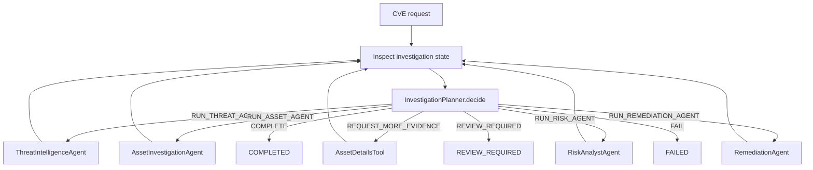

# Phase 5B — Bounded agentic investigation

Phase 5B evolves the Phase 5A **fixed** workflow into an inspect-and-decide loop. The default path is still:

`CVE → Threat → Asset → Risk → Remediation → COMPLETE`

That sequence is the **fallback** when evidence is complete and confidence is not `LOW`. The orchestrator no longer assumes the next agent blindly; it inspects `SecurityInvestigationContext`, records a typed `AgentDecision`, then runs at most one tool/agent per iteration.

Phase 5A agents, tools, REST paths, and Kafka topics are preserved. This is not a new project and does not add Jira, GitHub, ServiceNow, SIEM, or cloud inventory.

## Agentic orchestration (hybrid)



```
while investigation is not terminal:
    inspect context (missing evidence, confidence, failures)
    decide next AgentAction (deterministic planner)
    record WHAT / WHY / required evidence
    execute one agent or tool
    update context + execution trace
    increment iteration (agent/tool actions only)

if iteration cap reached → REVIEW_REQUIRED
```

Hard security facts stay **tool-backed**:

| Fact | Source of truth |
|---|---|
| CVE row, CVSS, products, CPE | `CveLookupTool` / `CpeLookupTool` |
| Affected assets, version match | Correlation engine + inventory |
| Risk score / level | Risk engine (`formula_version=v1`) |
| Remediation approval | Not in this phase (plan stays `GENERATED`) |

The planner reasons about those facts. It does **not** invent CVE data, assets, CPE matches, versions, or risk scores. LLM output (Phase 3 RAG summary / knowledge search) is **interpretation**, not deterministic evidence.

## Decision loop

`InvestigationPlanner.decide(context, maxIterations)` returns an `AgentDecision`:

| `nextAction` | When |
|---|---|
| `RUN_THREAT_AGENT` | Threat result missing and threat agent has not failed |
| `RUN_ASSET_AGENT` | Threat present (not LOW) and assets missing |
| `REQUEST_MORE_EVIDENCE` | Affected assets exist but correlation confidence is `LOW` and `AssetDetailsTool` has not run |
| `RUN_RISK_AGENT` | Assets affected and confidence is not `LOW` |
| `RUN_REMEDIATION_AGENT` | Remediation gate passes |
| `COMPLETE` | Not affected, or threat+assets+risk+remediation present |
| `REVIEW_REQUIRED` | Unknown CVE, threat `LOW`, assets still `LOW` after details, gate fail, **or** `iterationCount >= AI_MAX_AGENT_ITERATIONS` |
| `FAIL` | Correlation failed (exposure unknown), risk engine failed, or remediation failed after prior evidence |

`AI_MAX_AGENT_ITERATIONS` (default **10**) is the loop cap. Completing or reviewing does not increment the counter; running an agent or `AssetDetailsTool` does.

## Investigation state

API `status` is still `PENDING | RUNNING | COMPLETED | FAILED | REVIEW_REQUIRED`.

Granular `currentState`:

`INITIALIZED → INVESTIGATING → THREAT_ANALYZED → ASSETS_ANALYZED → RISK_ANALYZED → REMEDIATION_GENERATED → COMPLETED`

Plus `REVIEW_REQUIRED` and `FAILED`.

Context also tracks `completedAgents`, `pendingAgents`, `iterationCount`, `overallConfidence`, `decisionHistory`, and `executionTrace`.

## Evidence model

`EvidenceItem` records `source`, `type`, `description`, `value`, `confidence`, `timestamp`, and `authority`:

- `DETERMINISTIC` — CVE database, CPE lookup, correlation engine, asset inventory, risk engine, knowledge-base retrieval metadata
- `INTERPRETATION` — LLM wording (`EvidenceSource.LLM`)

Example authoritative fact: correlation reports `Asset srv-prod-01` matched a CPE with version evidence.

Example interpretation: an LLM sentence that assets “appear highly exposed”. That must not override correlation.

## Confidence

`HIGH | MEDIUM | LOW` is assigned by `InvestigationConfidence` from **evidence rules**, not by a free-form LLM:

| Situation | Confidence |
|---|---|
| Threat: CVSS + products, exploit flags known | `HIGH` |
| Threat: exploit flags `UNKNOWN_FROM_SOURCE` | `MEDIUM` |
| Threat: missing CVSS or products | `LOW` → `REVIEW_REQUIRED` |
| Assets: not affected after successful correlation | `HIGH` |
| Assets: `EXACT_VERSION_MATCH` or version in match reason | `HIGH` if match confidence is HIGH |
| Assets: `LOW` match confidence or missing version | `LOW` → request inventory details once, then review if still low |
| Risk engine score present | `HIGH` |

## Tool abstraction

Agents call typed tools, not HTTP clients:

| Agent | Tools |
|---|---|
| Threat | `CveLookupTool`, `CpeLookupTool`, `VulnerabilityContextTool` |
| Asset | `CorrelationTool`, `AffectedAssetLookupTool`; extra evidence via `AssetInventoryTool` / `AssetDetailsTool` |
| Risk | `RiskCalculationTool` |
| Remediation | `KnowledgeSearchTool`, `PolicyRetrievalTool`, `RemediationGenerationTool` |

Implementations: database repositories and existing HTTP wrappers (`HttpCorrelationTool`, `HttpRiskCalculationTool`). Demo mode still skips live OpenAI.

## Security gates

**Remediation gate** (`InvestigationPlanner.remediationGate`): threat result, asset investigation, deterministic `riskScore`, and neither threat nor assets at `LOW`. Otherwise remediation is not invoked.

Correlation failure is **never** treated as “not affected”.

Unknown CVE / threat lookup failure → `REVIEW_REQUIRED` (same as Phase 5A), not a fabricated recommendation.

## Human review

`REVIEW_REQUIRED` is a first-class outcome when evidence is insufficient, confidence is `LOW`, the iteration cap is hit, the CVE is unknown, or the remediation gate fails. The recommendation summary is prefixed with `REVIEW_REQUIRED:` and does not silently invent a patch plan.

## Bounded autonomy

There is no unrestricted agent loop. Maximum iterations are configurable. Terminal statuses stop the loop. The planner is a deterministic state machine; LLM/RAG is only used inside existing Phase 3 generation and optional knowledge search.

## Auditability

Each planner call stores a `DecisionRecord` (action, reason, required evidence, result status, confidence, timestamp) and an `ExecutionTraceEntry` (agent/tool, times, duration, evidence produced, error). GET investigation returns both.

## REST

Existing `POST/GET /api/v1/investigations` remain. GET/POST JSON **adds** (clients can ignore unknown fields):

- `currentState`
- `confidence`
- `decisionHistory`
- `executionTrace`

`evidence` was already present.

## Database

Flyway **V8** extends `security_investigations` (no new tables):

- `current_state`, `overall_confidence`, `iteration_count`
- `decision_history`, `execution_trace`, `completed_agents`, `pending_agents` (JSONB)

Defaults keep V7 rows readable. api-service still applies migrations.

## Failure handling

| Case | Outcome |
|---|---|
| Unknown CVE / threat agent fail | `REVIEW_REQUIRED` |
| Threat `LOW` | `REVIEW_REQUIRED` (assets/risk/remediation not run) |
| Correlation fail | `FAILED`, assets null |
| Asset `LOW` | `AssetDetailsTool` once; still `LOW` → `REVIEW_REQUIRED` |
| Not affected | `COMPLETED`, skip risk/remediation |
| Risk fail | `FAILED`, skip remediation |
| Remediation fail | `FAILED`, keep threat/asset/risk |
| Max iterations | `REVIEW_REQUIRED` |

## Tests

All tests run without an OpenAI API key (tools mocked, `AI_DEMO_MODE` unused in unit tests). See `OrchestratorTest` and `InvestigationPlannerTest`.
