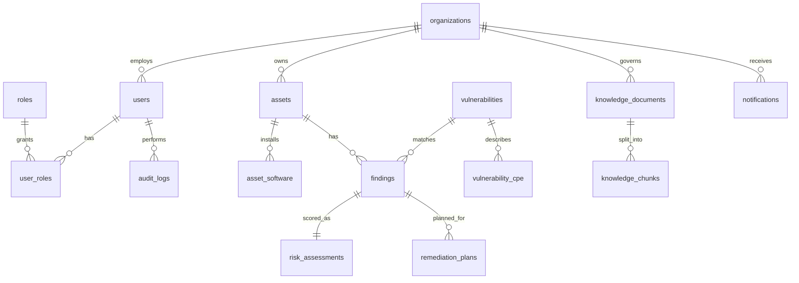

# ER model

Mermaid diagram of V1 relationships. Cardinalities are logical, not every FK column.



## Hierarchy (product language)

```
Organization
  └── Assets
        └── Asset Software

Vulnerability
  └── Vulnerability CPE

Asset + Vulnerability
  └── Finding
        ├── Risk Assessment
        └── Remediation Plan

Knowledge Document
  └── Knowledge Chunks (pgvector embedding)
```

## Finding explanation

`findings.match_explanation` (JSONB) stores deterministic correlation evidence, for example:

```json
{
  "matchedOn": ["cpe", "vendor", "product", "versionRange"],
  "assetSoftwareId": "...",
  "vulnerabilityCpeId": "...",
  "installedVersion": "8.0.1",
  "vulnerableRange": ">=8.0.0 <8.0.4",
  "notes": "CPE match plus inclusive lower bound"
}
```

This is required so analysts can see **why** an asset was marked vulnerable.

## Users and roles

Roles are data (`ADMIN`, `SECURITY_ANALYST`, `SECURITY_MANAGER`, `VIEWER`) plus Spring Security mappings documented in api-service. V1 seeds one user per role for local login (later phases).
